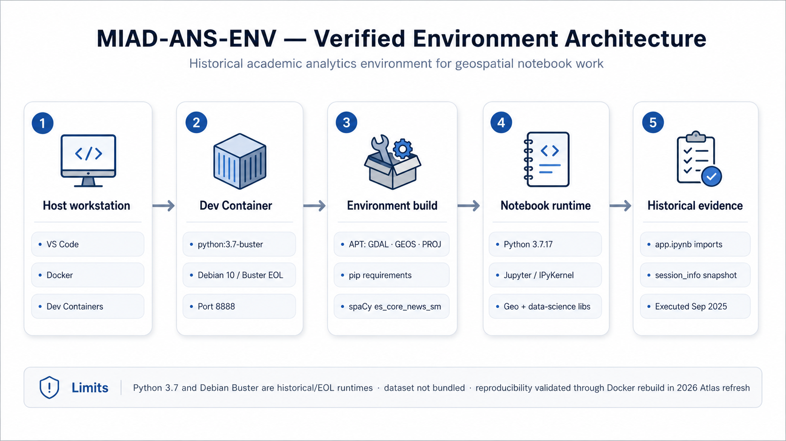

<p align="left">
  <a href="https://docs.docker.com/desktop/">
    
  </a>
  <a href="https://code.visualstudio.com/download">
    
  </a>
  <a href="https://www.python.org/">
    
  </a>
  
  
</p>

# MIAD-ANS-ENV

## Overview

MIAD-ANS-ENV is a historical academic analytics environment created to support the **Module 7: Datos Espaciales** work of the **Aprendizaje No Supervisado** course at Universidad de los Andes.

Its smallest verified role is a reproducible development environment for geospatial and data-science notebook work. It is **not** presented as a production deployment, cloud platform, packaged dataset, or performance benchmark.



## Original context

The repository documentation identifies the environment as supporting Module 7, *Datos Espaciales*, of the *Aprendizaje No Supervisado* course at Uniandes.

The visible repository history places the original work in **September 2025**. The 2026 Project Atlas work is a documentation, publication-safety, and reproducibility refresh and must not be interpreted as part of the original academic period.

## Period and status

* **Original visible period:** 2025-09-16 to 2025-09-26.
* **Portfolio classification:** Historical.
* **Atlas block:** Data / Platform Engineering.
* **Evidence role:** Reproducible Analytics Environments / developer enablement.
* **Historical execution:** verified from repository notebook evidence.
* **2026 rebuild status:** verified through Docker build, startup, representative imports, notebook execution, teardown, no-cache rebuild, and import revalidation.

## Environment architecture

The environment is defined primarily by:

1. VS Code Dev Containers and Docker on the host.
2. `.devcontainer/Dockerfile` based on `python:3.7-buster`.
3. Debian 10 / Buster-era system packages for GDAL, GEOS, PROJ, ZeroMQ, curl/SSL/XML/ICU support and common developer utilities.
4. Python dependencies declared in `.devcontainer/requirements.txt`.
5. A small 2026 compatibility constraint layer for transitive packages that drifted beyond Python 3.7 compatibility.
6. A Spanish spaCy model downloaded during the image build.
7. A Jupyter/IPython kernel used to execute `app.ipynb`.

The architecture diagram focuses on the verified environment flow:

**host workstation → Dev Container → environment build → notebook runtime → execution evidence**

The 2026 Atlas remediation remains documented separately and is not represented as part of the original 2025 architecture.

## Runtime

Historical repository evidence records:

* Python `3.7.17`;
* Debian 10 / Buster-era container base;
* Jupyter/IPython notebook tooling;
* geospatial libraries including GeoPandas, Shapely, PyProj, Pyrosm, Folium and GeoPy;
* data-science libraries including pandas, NumPy, SciPy, scikit-learn, seaborn, Bokeh and statsmodels.

The Dockerfile redirects Debian Buster package sources to Debian's archive because Buster is end-of-life.

This preserves the historical runtime while making its lifecycle limitations explicit.

## Dependencies

`.devcontainer/requirements.txt` is **partially pinned**, not a complete dependency lock.

Several important libraries have explicit historical versions while others remain unpinned. The file also contains a duplicate `geopandas` declaration.

Therefore:

* the repository captures a meaningful historical dependency snapshot;
* it does not provide a complete lockfile;
* transitive dependency drift remains possible;
* historical notebook execution and present-day reconstruction are treated as separate evidence.

### Python 3.7 compatibility constraints

The 2026 reproducibility validation identified transitive package releases that had moved beyond practical Python 3.7 compatibility.

Rather than rewriting the historical dependency declarations, the refresh keeps those declarations intact and adds:

```text
.devcontainer/constraints-py37.txt
```

The compatibility layer currently constrains:

```text
murmurhash==1.0.10
cymem==2.0.8
preshed==3.0.7
```

These constraints are **2026 reproducibility controls**, not claims about the exact package versions used during the original September 2025 work.

No mass dependency modernization is performed by the Atlas refresh.

## Quick start

### Prerequisites

* Git
* Docker with a working Linux-container engine
* VS Code
* the Dev Containers extension

Clone and open the repository:

```bash
git clone https://github.com/HubertRonald/MIAD-ANS-ENV.git
cd MIAD-ANS-ENV
code .
```

Then use:

**Dev Containers: Reopen in Container**

After the image and container are ready, select the kernel:

```text
Python 3.7 (MIAD-ANS-ENV)
```

and open:

```text
app.ipynb
```

The historical Python runtime can be confirmed from inside the environment with:

```bash
python --version
```

Expected historical runtime:

```text
Python 3.7.17
```

## Tools

The repository directly evidences use or configuration of:

* Docker;
* VS Code Dev Containers;
* Python;
* Jupyter/IPython;
* Git;
* GitHub CLI as a Dev Container feature;
* geospatial Python libraries;
* general data-science Python libraries.

Presence in a dependency file is not, by itself, treated as proof of project-level capability beyond the environment it supports.

## Reproducibility

### Historical evidence

`app.ipynb` contains an executed environment snapshot from September 2025 recording Python, operating-system, Jupyter, and library information.

The notebook also preserves a historical GEOS/PyGEOS compatibility warning, providing additional evidence of the actual environment state used at execution time.

Historical execution is therefore supported by repository evidence.

### 2026 validation

The Project Atlas refresh subsequently tested the environment from a Docker-capable host.

The following validation tiers completed successfully:

* **Tier A — configuration/static validation:** passed;
* **Tier B — Docker image build:** passed;
* **Tier C — container startup:** passed;
* **Tier D — representative imports/tool availability:** passed;
* **Tier E — `app.ipynb` execution:** passed;
* **Tier F — teardown, no-cache rebuild and import revalidation:** passed.

The representative runtime reported:

```text
Python 3.7.17
```

Notebook execution completed through `nbconvert`, and the final no-cache reconstruction completed successfully.

The correct evidence statement is therefore:

> **Historically executed and successfully reconstructed during the 2026 reproducibility refresh.**

This validation demonstrates reconstructability under the tested Docker environment; it does not turn the historical runtime into a currently supported platform.

## Datasets and provenance

No dataset is tracked as part of the repository tree used to define this environment.

The repository should therefore not be presented as redistributing a course dataset.

If a future notebook workflow downloads or requires external data, its:

* source;
* license or terms;
* version;
* redistribution constraints;
* personal-data implications

should be documented before publication claims are added.

## Security and publication

The original Dev Container configuration included implicit host mounts for:

```text
~/.gitconfig
~/.config/gh
```

Those mounts were convenient local assumptions but were unnecessary for reproducing the analytics environment and could expose host-local configuration or authentication material to the container.

The 2026 refresh removes those mounts.

The refresh also keeps Project Atlas orchestrator metadata outside the repository:

* `project.meta.yml`;
* `orchestrator_handoff.yml`;
* remediation-bundle `HOOK.md`;
* bundle-only evidence files.

The repository scan executed during the refresh reported:

```text
high:   0
medium: 0
low:    0
```

Publication-safety validation should still be repeated whenever repository content changes materially.

## Limitations

* Python 3.7 and Debian Buster are historical/EOL runtimes.
* Dependencies are only partially pinned.
* Historical notebook output evidences PyGEOS in the executed environment, but `.devcontainer/requirements.txt` does not declare it directly; its installation path and exact historical version are therefore not reproducibly established.
* No complete lockfile or immutable container-image digest is preserved from the original period.
* The original Dev Container configuration made host-specific `${localEnv:USER}` and Git/GitHub configuration-mount assumptions.
* The successful 2026 rebuild depends on compatibility constraints and continued availability of historical base-image/package sources.
* Rebuild validation demonstrates reproducibility under the tested environment, not long-term supportability of Python 3.7 or Debian Buster.
* The repository does not demonstrate production deployment, uptime, cloud architecture, benchmark performance, or packaged dataset provenance.

## Historical context and 2026 refresh

The September 2025 repository remains the historical foundation.

The 2026 Project Atlas remediation is intentionally conservative:

* clarify the original academic purpose and evidence boundary;
* preserve the historical Python 3.7 runtime rather than replacing it;
* fix the malformed kernel `postCreateCommand`;
* remove host-specific Git/GitHub configuration mounts;
* introduce narrowly scoped Python 3.7 compatibility constraints for verified transitive dependency drift;
* add an evidence-backed environment architecture diagram;
* validate configuration and publication boundaries;
* execute build, startup, imports, notebook execution, teardown, no-cache rebuild and revalidation;
* keep broad dependency modernization outside the scope of this historical refresh.

No 2026 commit should be backdated into the 2025 repository history.

## Builder Journey

The repository provides modest but useful evidence for this progression:

**reproducible development environments → analytics environments → developer enablement**

Its relationship to later data/platform engineering work is curatorial: it demonstrates an earlier practice of packaging a usable analytics workstation around code, dependencies and notebooks.

It is not presented as a technical dependency of later projects.

## Author

* **Hubert Ronald** — original work — [GitHub](https://github.com/HubertRonald)
* **Portfolio:** [hubertronald.github.io](https://hubertronald.github.io/)

See also the repository's [contributors](https://github.com/HubertRonald/MIAD-ANS-ENV/contributors).

## License

This project is licensed under the MIT License. See [LICENSE](LICENSE) for details.
